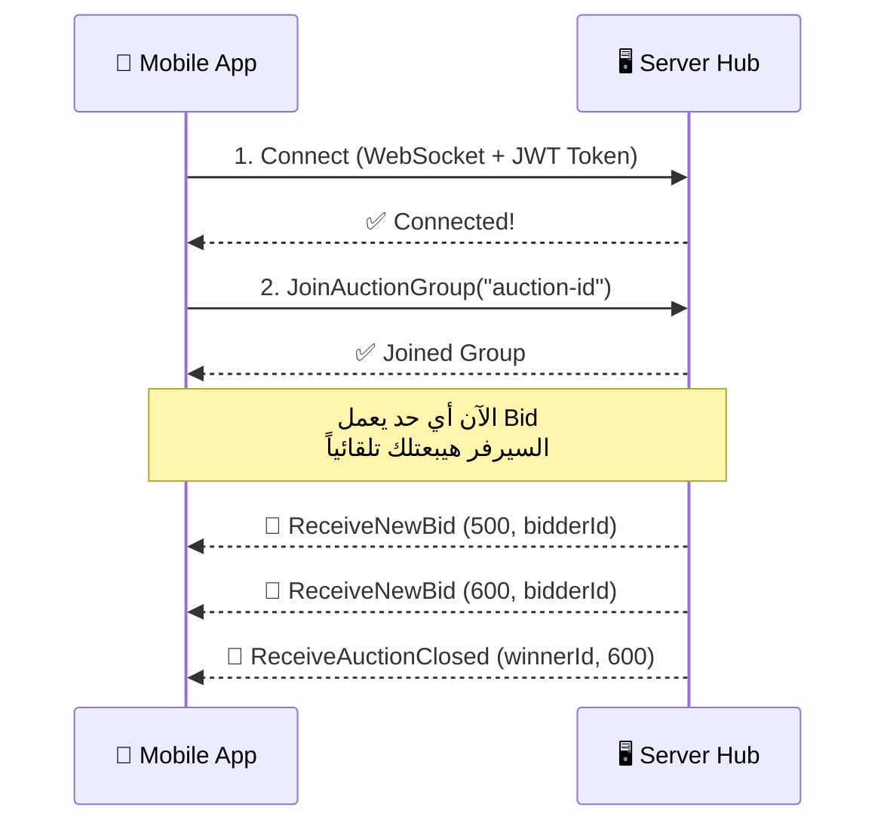

# 📡 دليل مبرمج الموبايل - SignalR Hubs في Root2Route

## ايه هو SignalR؟

SignalR هو **اتصال Real-Time ثنائي الاتجاه** بين الموبايل والسيرفر. بدل ما الموبايل يعمل request كل شوية يسأل "في حاجة جديدة؟"، السيرفر **هو اللي بيبعتلك** لحظياً.



---

## المشروع عنده Hub-ين (2 endpoints)

| Hub | URL Path | الوظيفة |
|-----|----------|---------|
| **AuctionHub** | `/hubs/auction` | المزادات الحية (Live Bidding) |
| **ChatHub** | `/hubs/chat` | الشات والإشعارات والتفاوض |

> [!IMPORTANT]
> الـ Base URL هيكون حاجة زي: `https://your-server.com`  
> فالـ Hub URL الكامل هيكون: `https://your-server.com/hubs/auction`

> [!WARNING]
> **الـ ChatHub لسه مش مضاف في `Program.cs`!** لازم الباكإند يضيف السطر ده:
> ```csharp
> app.MapHub<ChatHub>("/hubs/chat").RequireCors("SignalRPolicy");
> ```
> قبل ما الموبايل يقدر يتصل بيه.

---

## ⚙️ الخطوة 1: تنصيب الـ SignalR Client Library

### Flutter (Dart)
```yaml
# pubspec.yaml
dependencies:
  signalr_netcore: ^1.3.7
  # أو
  signalr_core: ^1.1.1
```

### Kotlin (Android)
```gradle
// build.gradle
implementation 'com.microsoft.signalr:signalr:7.0.0'
```

### Swift (iOS)
```swift
// Package.swift أو CocoaPods
// SwiftSignalRClient
.package(url: "https://github.com/moozzyk/SignalR-Client-Swift", from: "0.9.0")
```

---

## 🔌 الخطوة 2: الاتصال بالـ Hub

### المفهوم الأساسي

الاتصال بيتم عن طريق:
1. **بناء الـ Connection** مع الـ Hub URL
2. **إرسال الـ JWT Token** عشان السيرفر يعرفك مين (Authentication)
3. **بدء الاتصال** `.start()`

### Flutter Example (الأكثر استخداماً)

```dart
import 'package:signalr_netcore/signalr_client.dart';

class AuctionHubService {
  late HubConnection _hubConnection;
  
  // ===== 1. بناء الاتصال =====
  Future<void> connect(String jwtToken) async {
    final serverUrl = "https://your-server.com/hubs/auction";
    
    _hubConnection = HubConnectionBuilder()
        .withUrl(
          serverUrl,
          options: HttpConnectionOptions(
            accessTokenFactory: () async => jwtToken,  // 🔑 التوكن بتاعك
            // skipNegotiation: true,  // اختياري: لتسريع الاتصال
            // transport: HttpTransportType.WebSockets,
          ),
        )
        .withAutomaticReconnect()  // ⚡ يعيد الاتصال تلقائياً لو وقع
        .build();

    // ===== 2. الاستماع للأحداث (Events) =====
    _setupListeners();

    // ===== 3. بدء الاتصال =====
    await _hubConnection.start();
    print("✅ Connected to AuctionHub!");
  }
  
  void _setupListeners() {
    // لما حد يعمل Bid جديد
    _hubConnection.on("ReceiveNewBid", (arguments) {
      final amount = arguments![0] as double;    // المبلغ
      final bidderId = arguments[1] as String;    // مين عمل الـ Bid
      print("🔔 New Bid: $amount from $bidderId");
      // ← هنا تعمل Update للـ UI
    });

    // لما المزاد يخلص
    _hubConnection.on("ReceiveAuctionClosed", (arguments) {
      final winnerId = arguments![0];             // مين كسب
      final finalPrice = arguments[1] as double;  // السعر النهائي
      print("🏆 Auction Closed! Winner: $winnerId at $finalPrice");
      // ← هنا تعرض شاشة النتيجة
    });
  }
  
  // ===== 4. دخول غرفة المزاد =====
  Future<void> joinAuction(String auctionId) async {
    await _hubConnection.invoke("JoinAuctionGroup", args: [auctionId]);
    print("📌 Joined auction: $auctionId");
  }
  
  // ===== 5. مغادرة غرفة المزاد =====
  Future<void> leaveAuction(String auctionId) async {
    await _hubConnection.invoke("LeaveAuctionGroup", args: [auctionId]);
    print("👋 Left auction: $auctionId");
  }
  
  // ===== 6. جلب حالة المزاد الحالية =====
  Future<Map<String, dynamic>?> getAuctionState(String auctionId) async {
    final result = await _hubConnection.invoke("GetAuctionState", args: [auctionId]);
    return result as Map<String, dynamic>?;
    // result = { "currentHighestBid": 500.0, "highestBidderId": "guid-here" }
  }
  
  // ===== 7. قطع الاتصال =====
  Future<void> disconnect() async {
    await _hubConnection.stop();
  }
}
```

### Kotlin Example (Android)

```kotlin
import com.microsoft.signalr.HubConnection
import com.microsoft.signalr.HubConnectionBuilder
import com.microsoft.signalr.HubConnectionState

class AuctionHubService {
    private lateinit var hubConnection: HubConnection

    fun connect(jwtToken: String) {
        hubConnection = HubConnectionBuilder
            .create("https://your-server.com/hubs/auction")
            .withAccessTokenProvider { Single.just(jwtToken) }  // 🔑
            .build()

        // الاستماع للأحداث
        hubConnection.on("ReceiveNewBid", { amount: Double, bidderId: String ->
            // 🔔 Update UI
            println("New bid: $amount from $bidderId")
        }, Double::class.java, String::class.java)

        hubConnection.on("ReceiveAuctionClosed", { winnerId: String?, finalPrice: Double ->
            // 🏆 Show result
            println("Winner: $winnerId at $finalPrice")
        }, String::class.java, Double::class.java)

        // بدء الاتصال
        hubConnection.start().blockingAwait()
    }

    fun joinAuction(auctionId: String) {
        hubConnection.invoke("JoinAuctionGroup", auctionId)
    }

    fun leaveAuction(auctionId: String) {
        hubConnection.invoke("LeaveAuctionGroup", auctionId)
    }

    fun disconnect() {
        hubConnection.stop()
    }
}
```

---

## 🏛️ AuctionHub — مرجع كامل

### 📤 Methods (الموبايل يبعتها للسيرفر)

| Method | Parameters | Return | الوظيفة |
|--------|-----------|--------|---------|
| `JoinAuctionGroup` | `string auctionId` | void | دخول غرفة مزاد معين عشان تستقبل التحديثات |
| `LeaveAuctionGroup` | `string auctionId` | void | مغادرة غرفة المزاد |
| `GetAuctionState` | `Guid auctionId` | `AuctionStateResponse` | جلب الحالة الحالية (أعلى bid ومين) |

### 📥 Events (السيرفر يبعتها للموبايل)

| Event Name | Parameters | متى بيتبعت؟ |
|------------|-----------|-------------|
| `ReceiveNewBid` | `decimal amount`, `Guid bidderId` | لما حد يعمل Bid جديد |
| `ReceiveAuctionClosed` | `Guid? highestBidderId`, `decimal currentHighestBid` | لما المزاد يخلص |

### 📦 AuctionStateResponse (الرد من GetAuctionState)

```json
{
  "currentHighestBid": 500.00,
  "highestBidderId": "3fa85f64-5717-4562-b3fc-2c963f66afa6"  // أو null لو مفيش bids
}
```

---

## 💬 ChatHub — مرجع كامل

### 📤 Methods (الموبايل يبعتها للسيرفر)

| Method | Parameters | Return | الوظيفة |
|--------|-----------|--------|---------|
| `JoinRoom` | `string roomId` | void | دخول غرفة شات (لازم تكون Buyer أو Seller Member) |
| `LeaveRoom` | `string roomId` | void | مغادرة غرفة الشات |
| `SendTypingIndicator` | `string roomId` | void | إرسال "بيكتب..." للطرف التاني |

> [!NOTE]
> **إرسال الرسائل مش من الـ Hub!** — إرسال الرسائل بيتم عن طريق **REST API عادي** (`POST /api/Chat/send`). السيرفر بعد كده هو اللي بيبعت الرسالة لكل اللي في الغرفة عن طريق الـ Hub.

### 📥 Events (السيرفر يبعتها للموبايل)

| Event Name | Payload | متى بيتبعت؟ |
|------------|---------|-------------|
| `ReceiveMessage` | `{ Id, ChatRoomId, SenderId, Content, Type, IsRead, SentAt, ProposedPrice, ProposedQuantity, RelatedOrderId }` | لما حد يبعت رسالة |
| `ReceiveTypingIndicator` | `string senderId` | لما الطرف التاني بيكتب |
| `ReceiveOfferAccepted` | `{ OrderId, Message: { Id, ChatRoomId, SenderId, Content, Type, SentAt, RelatedOrderId } }` | لما البائع يقبل عرض تفاوض |
| `ReceiveOfferRejected` | `{ OfferMessageId, Message: { Id, ChatRoomId, SenderId, Content, Type, SentAt } }` | لما البائع يرفض عرض تفاوض |
| `ChatRoomClosed` | `{ ChatRoomId, ClosedBy }` | لما حد يقفل الغرفة |
| `ReceiveMessageDeleted` | `{ MessageId, ChatRoomId }` | لما حد يمسح رسالة |
| `ReceiveNotification` | `{ Id, Title, Message, CreatedAt, IsRead, RelatedEntityId }` | إشعار عام (مثلاً "تم تجاوز عرضك") |

### 📦 MessageType Enum Values

| Value | Int | المعنى |
|-------|-----|--------|
| `Text` | 0 | رسالة نصية عادية |
| `Image` | 1 | صورة |
| `File` | 2 | ملف |
| `NegotiationOffer` | 3 | عرض تفاوض على سعر/كمية |
| `OfferAccepted` | 4 | تم قبول العرض (System Message) |
| `OfferRejected` | 5 | تم رفض العرض (System Message) |
| `Deleted` | 6 | رسالة محذوفة |

---

## 💬 ChatHub — Full Flutter Example

```dart
class ChatHubService {
  late HubConnection _hubConnection;

  Future<void> connect(String jwtToken) async {
    _hubConnection = HubConnectionBuilder()
        .withUrl(
          "https://your-server.com/hubs/chat",
          options: HttpConnectionOptions(
            accessTokenFactory: () async => jwtToken,
          ),
        )
        .withAutomaticReconnect()
        .build();

    _setupListeners();
    await _hubConnection.start();
  }

  void _setupListeners() {
    // ✉️ رسالة جديدة
    _hubConnection.on("ReceiveMessage", (args) {
      final message = args![0] as Map<String, dynamic>;
      // message["content"], message["senderId"], message["type"], etc.
      // ← أضف الرسالة للشاشة
    });

    // ⌨️ الطرف التاني بيكتب
    _hubConnection.on("ReceiveTypingIndicator", (args) {
      final senderId = args![0] as String;
      // ← أظهر "Typing..." indicator
    });

    // ✅ عرض تم قبوله
    _hubConnection.on("ReceiveOfferAccepted", (args) {
      final data = args![0] as Map<String, dynamic>;
      final orderId = data["orderId"];
      // ← أظهر رسالة نجاح + رابط للأوردر
    });

    // ❌ عرض تم رفضه
    _hubConnection.on("ReceiveOfferRejected", (args) {
      final data = args![0] as Map<String, dynamic>;
      // ← أظهر رسالة إن العرض اترفض
    });

    // 🔒 الغرفة اتقفلت
    _hubConnection.on("ChatRoomClosed", (args) {
      final data = args![0] as Map<String, dynamic>;
      // ← امنع إرسال رسائل جديدة + أظهر بانر
    });

    // 🗑️ رسالة اتمسحت
    _hubConnection.on("ReceiveMessageDeleted", (args) {
      final data = args![0] as Map<String, dynamic>;
      final messageId = data["messageId"];
      // ← احذف/استبدل الرسالة في الـ UI
    });

    // 🔔 إشعار عام
    _hubConnection.on("ReceiveNotification", (args) {
      final notification = args![0] as Map<String, dynamic>;
      // notification["title"], notification["message"]
      // ← أظهر Push Notification محلي
    });
  }

  // دخول غرفة شات
  Future<void> joinRoom(String roomId) async {
    await _hubConnection.invoke("JoinRoom", args: [roomId]);
  }

  // مغادرة غرفة شات
  Future<void> leaveRoom(String roomId) async {
    await _hubConnection.invoke("LeaveRoom", args: [roomId]);
  }

  // إرسال مؤشر "بيكتب"
  Future<void> sendTyping(String roomId) async {
    await _hubConnection.invoke("SendTypingIndicator", args: [roomId]);
  }

  Future<void> disconnect() async {
    await _hubConnection.stop();
  }
}
```

---

## 🔄 الـ Lifecycle — السيناريو الكامل

### سيناريو المزاد (Auction)

```
📱 المستخدم يفتح صفحة المزاد
    │
    ├── 1. connect() → الاتصال بالـ AuctionHub
    ├── 2. joinAuction(auctionId) → دخول غرفة المزاد
    ├── 3. getAuctionState(auctionId) → جلب آخر حالة (أعلى bid)
    │
    │   ⏳ المستخدم شايف المزاد...
    │   │
    │   ├── 🔔 ReceiveNewBid → تحديث السعر في الـ UI
    │   ├── 🔔 ReceiveNewBid → تحديث السعر في الـ UI
    │   └── 🔔 ReceiveAuctionClosed → عرض النتيجة النهائية
    │
    ├── 4. leaveAuction(auctionId) → مغادرة الغرفة
    └── 5. disconnect() → قطع الاتصال
```

### سيناريو الشات (Chat)

```
📱 المستخدم يفتح محادثة
    │
    ├── 1. connect() → الاتصال بالـ ChatHub  
    ├── 2. joinRoom(roomId) → دخول غرفة الشات
    │
    │   ⏳ محادثة جارية...
    │   │
    │   ├── 🔔 ReceiveMessage → عرض رسالة جديدة
    │   ├── ⌨️ ReceiveTypingIndicator → عرض "بيكتب..."
    │   ├── ✅ ReceiveOfferAccepted → عرض تم قبوله!
    │   └── 🔒 ChatRoomClosed → الغرفة اتقفلت
    │
    │   📤 المستخدم عايز يبعت رسالة:
    │   └── POST /api/Chat/send (REST API عادي، مش من الـ Hub!)
    │
    ├── 3. leaveRoom(roomId) → مغادرة الغرفة
    └── 4. disconnect() → قطع الاتصال
```

---

## ⚠️ نقاط مهمة جداً

### 1. الـ Authentication (JWT Token)
```
التوكن بيتبعت في الـ Query String تلقائياً:
ws://server.com/hubs/auction?access_token=YOUR_JWT_TOKEN

المكتبة بتعمل ده تلقائياً لما تستخدم accessTokenFactory.
```

> [!WARNING]
> **الباكإند لسه ما ضافش `OnMessageReceived` event في JWT config!** 
> ده معناه إن الـ Authentication ممكن ما تشتغلش مع الـ WebSocket.
> **لازم الباكإند يضيف ده في `Program.cs`:**
> ```csharp
> .AddJwtBearer(options =>
> {
>     // ... existing config ...
>     options.Events = new JwtBearerEvents
>     {
>         OnMessageReceived = context =>
>         {
>             var accessToken = context.Request.Query["access_token"];
>             var path = context.HttpContext.Request.Path;
>             if (!string.IsNullOrEmpty(accessToken) && path.StartsWithSegments("/hubs"))
>             {
>                 context.Token = accessToken;
>             }
>             return Task.CompletedTask;
>         }
>     };
> });
> ```

### 2. Auto Reconnect
```dart
.withAutomaticReconnect()  // ⚡ مهم جداً — لو النت وقع يرجع تلقائياً
```

**بعد الـ Reconnect لازم تعمل re-join للغرف تاني!**
```dart
_hubConnection.onreconnected((connectionId) {
  // Re-join rooms after reconnection
  joinAuction(currentAuctionId);
});
```

### 3. Connection States
```dart
// التحقق من حالة الاتصال
if (_hubConnection.state == HubConnectionState.Connected) {
  // متصل ✅
} else if (_hubConnection.state == HubConnectionState.Disconnected) {
  // مش متصل ❌ — حاول تعيد الاتصال
}
```

### 4. Error Handling
```dart
_hubConnection.onclose((error) {
  print("❌ Connection closed: $error");
  // ← أظهر رسالة للمستخدم أو حاول أعد الاتصال
});
```

---

## 📋 Checklist لمبرمج الموبايل

- [ ] تنصيب SignalR Client Library
- [ ] إنشاء Service class لكل Hub (AuctionHubService, ChatHubService)
- [ ] ربط الـ JWT Token مع الاتصال
- [ ] تسجيل كل الـ Event Listeners قبل `.start()`
- [ ] Handle الـ Reconnection وإعادة الانضمام للغرف
- [ ] Handle الـ Connection errors gracefully
- [ ] تأكد إن الـ `disconnect()` بيتعمل لما المستخدم يطلع من الشاشة
- [ ] **تنسيق مع الباكإند** إن `ChatHub` مضاف في Program.cs و JWT OnMessageReceived مضاف
