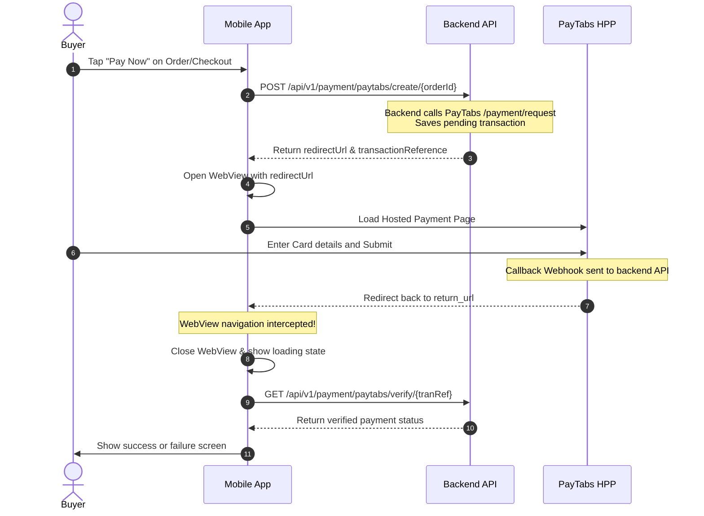

# PayTabs Payment Gateway — Mobile Integration Plan

This document outlines the steps, API specifications, and flow details required to integrate the PayTabs payment gateway into the mobile application (iOS/Android/Flutter/React Native).

---

## 1. Overview of the Integration Flow

The backend is configured for the **Hosted Payment Page (HPP)** redirect flow. Since security credentials (like server keys) must never be embedded in client-side code, the backend handles transaction creation and signature verification.

The mobile app will display the payment page in a WebView, monitor the URL, intercept the redirect when the payment is completed, and verify the transaction status with the backend.



---

## 2. API Reference

All requests must be authenticated. Include the user's JWT in the headers:
`Authorization: Bearer <Your-JWT-Token>`

### A. Create Payment Request
Initiate a transaction for a specific order.

* **Endpoint:** `POST /api/v1/payment/paytabs/create/{orderId}`
* **Headers:**
  * `Authorization: Bearer <JWT_TOKEN>`
  * `Content-Type: application/json`
* **Path Parameters:**
  * `orderId` (UUID, Required) - The unique ID of the order.
* **Request Body:** None (empty body)
* **Success Response (200 OK):**
  ```json
  {
    "statusCode": 200,
    "meta": null,
    "succeeded": true,
    "message": "Payment initiated successfully",
    "errors": null,
    "data": {
      "redirectUrl": "https://secure.paytabs.sa/payment/request/300222/...",
      "transactionReference": "TST260621234567"
    }
  }
  ```

---

### B. Verify Transaction Status
Query the backend to confirm if the payment was successfully processed. Do NOT rely entirely on the URL redirect parameters for updating application state; always confirm status by calling this endpoint.

* **Endpoint:** `GET /api/v1/payment/paytabs/verify/{tranRef}`
* **Headers:**
  * `Authorization: Bearer <JWT_TOKEN>`
* **Path Parameters:**
  * `tranRef` (string, Required) - The `transactionReference` returned from the creation step.
* **Success Response (200 OK):**
  ```json
  {
    "statusCode": 200,
    "meta": null,
    "succeeded": true,
    "message": "Transaction verified.",
    "errors": null,
    "data": {
      "status": "Captured",
      "orderId": "d16c52a0-4357-410a-b30f-b1e6a147e8bb",
      "amount": 250.00,
      "paidAt": "2026-06-21T01:02:11.456Z"
    }
  }
  ```

#### Transaction Status Values (`data.status`):
* `Pending`: Payment is not completed yet.
* `Captured`: Payment completed successfully (This is the **success** state).
* `Failed`: Payment failed, rejected, or expired.
* `Refunded`: Transaction has been refunded.

---

## 3. WebView Interception Implementation

When loading the PayTabs HPP inside your mobile app's WebView (e.g. Flutter `InAppWebView`, React Native `WebView`, iOS `WKWebView`, Android `WebView`), you must inspect navigation requests.

### Key Redirection URL
* **Return URL:** `https://root2route.runasp.net/payment/result`

### Implementation Strategy:
1. **Initialize Payment:** Call the `POST` create endpoint to get the `redirectUrl` and `transactionReference`.
2. **Launch WebView:** Load the `redirectUrl` in a full-screen WebView.
3. **Monitor Navigation:** Intercept requests before they are loaded.
4. **Detect Callback/Return:**
   * Watch for URLs containing `/payment/result`.
   * PayTabs will redirect the WebView to this URL once the user completes the flow.
5. **Dismiss & Verify:**
   * When `/payment/result` is detected, **stop WebView navigation**, close/dismiss the WebView, and display a native loading screen.
   * Call `GET /api/v1/payment/paytabs/verify/{tranRef}` using your stored `transactionReference`.
   * Update order status UI depending on whether `status` is `Captured`.

### Example (Pseudocode for WebView interception):

```javascript
// React Native WebView Example
const handleNavigationStateChange = (navState) => {
  const { url } = navState;
  
  if (url.includes('/payment/result')) {
    // 1. Close/Hide WebView
    setWebViewVisible(false);
    
    // 2. Call backend verification API using the reference we got from create
    verifyPayment(savedTransactionRef);
  }
};
```

```dart
// Flutter InAppWebView Example
onLoadStart: (controller, url) {
  if (url.toString().contains('/payment/result')) {
    // 1. Close / pop the WebView screen
    Navigator.of(context).pop();
    
    // 2. Query status from backend
    verifyPayment(savedTransactionRef);
  }
}
```

---

## 4. Best Practices & Edge Cases

* **Handling Manual Cancellation:** If the user presses the native "Back" button or closes the WebView modal manually, warn them that the transaction might be incomplete. Query the verification endpoint to verify if a payment actually went through before updating local cart/order state.
* **Server-to-Server Webhook:** The backend listens to PayTabs' webhook (`callback`). Therefore, even if the user closes the app immediately after paying (before the WebView redirects), the backend will still receive the confirmation from PayTabs and update the order state.
* **Clean State:** After a successful payment, clear the cart context/state on the mobile app.
